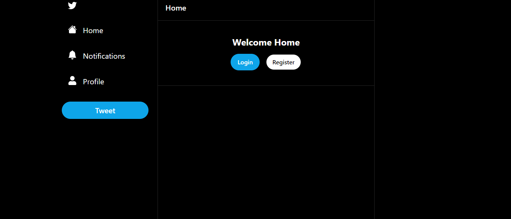

A Twitter clone project built using TypeScript and React. The project is structured around the Next.js framework.

Components:
Various files under the components directory: These are React components, which are reusable pieces of the user interface. Some notable components include Avatar, Button, Form, Header, ImageUpload, Modal, NotificationsFeed, and more.

Hooks:
Various files under the hooks directory: These are custom React hooks, which allow you to use state and other React features without writing a class. Some of the hooks include functionalities related to user authentication, post interactions, and modals.

Libraries:
Files under the libs directory: These are utility functions or configurations, such as fetcher.ts for fetching data, prismadb.ts for Prisma database configurations, and serverAuth.ts for server-side authentication.

API Routes:
Files under the pages/api directory: These are API routes powered by Next.js, which handle various functionalities like authentication, comments, posts, users, and more.

Pages:
Various files under the pages directory: These are the main pages of the web application, including the homepage (index.tsx), notifications page, individual post pages, and user profile pages.

Database Schema:
prisma/schema.prisma: This file defines the database schema for the application using Prisma, an open-source database toolkit.

Public Assets:
Files under the public directory: These are static assets like images and icons.

Styles:
styles/globals.css: Global styles for the application. Also, tailwind CSS.

